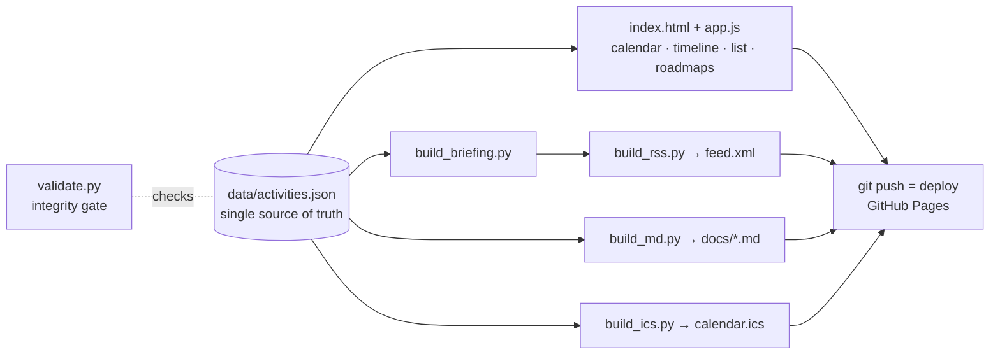

<div align="center">

# 📡 IT RADAR

**Catch every IT competition, hackathon, bootcamp, and dev event in Korea — before the deadline catches you.**

[](https://joon56.github.io/IT_RADAR/)

[](https://joon56.github.io/IT_RADAR/#view=list)
[](https://joon56.github.io/IT_RADAR/#view=briefing)
[](https://github.com/joon56/IT_RADAR/deployments)
[](https://joon56.github.io/IT_RADAR/feed.xml)

*Bilingual (한국어 / English) · Dark theme · Zero dependencies · Free forever*

📖 **[이용 가이드 (User Guide, Korean)](docs/GUIDE.md)**

</div>

---

## 🗺️ Five ways to look at the same radar

| | View | What it shows |
|:---:|:---|:---|
| 📅 | **Calendar** | Monthly grid with color-coded event chips. Click any date to see that day's events and every activity currently accepting applications. |
| 📊 | **Timeline** | A 6-month gantt: green application windows, blue activity periods, red deadline diamonds, and a today line. |
| 📋 | **List** | Filter by status, category, and tags. Full-text search in both languages. D-day badges that turn red as deadlines close in. |
| 🧭 | **Roadmaps** | Goal-based tracks — *Samsung employment*, *AI researcher*, *web dev*, *first activities*, *medical AI*, *global big tech* — each step wired to live activity data. |
| 📰 | **Briefing** | Auto-generated digest for every data refresh: what's new, what changed, what's due. Subscribable via RSS. |

## ✨ Personal, without an account

Everything personal stays in **your browser** (localStorage). No sign-up, no server, nothing shared.

- ⭐ **Bookmarks** — star activities, get a personal D-day strip and a "My picks" filter
- ✅ **Prep checklists** — per-activity to-dos with saved progress
- 🆕 **NEW badges** — see what appeared since *your* last visit
- 🌐 **KR / EN toggle** — every activity is fully bilingual
- 📆 **Calendar subscription** — one click adds every deadline to Google / Apple / Outlook calendars, auto-updating via [`calendar.ics`](https://joon56.github.io/IT_RADAR/calendar.ics)
- 🔗 **Shareable filters** — filter state lives in the URL hash

## ⚙️ How it works



One JSON file drives everything. Editing it and pushing **is** the whole deploy pipeline — no build tools, no npm, no framework.

## 🔄 Kept fresh automatically

A scheduled cloud agent re-verifies the data **three times a week** (Mon/Wed/Fri), following the 4-phase routine in [CLAUDE.md](CLAUDE.md):

1. **Deep web search** — verify every time-sensitive item against official sources; hunt for newly announced events
2. **Apply everywhere** — data, roadmaps, changelog, derived files
3. **Integrity gate** — `python3 tools/validate.py` must pass with 0 errors (bilingual coverage, date logic, reference checks, link liveness)
4. **Redeploy** — push to main

Data rules worth knowing: all dates are **KST**, activity IDs are **immutable** (bookmarks and calendar UIDs depend on them), yearly competitions **roll over** into new entries, and unverifiable dates are always marked *expected* — never fabricated.

## 📁 Structure

```text
data/activities.json    ← the one file that matters
index.html · css/ · js/ ← vanilla static site
tools/                  ← build_briefing · build_rss · build_md · build_ics · validate
calendar.ics · feed.xml ← generated feeds (subscribe!)
CLAUDE.md               ← data schema + maintenance playbook
```

---

<div align="center">

Published by **Minjoon Yoo**

[](mailto:webdamo56@gmail.com)
[](https://github.com/joon56)
[](https://www.linkedin.com/in/minjoon-yoo-798316286)

<sub>Schedules change at organizers' discretion — always confirm on the official site before applying.</sub>

</div>
